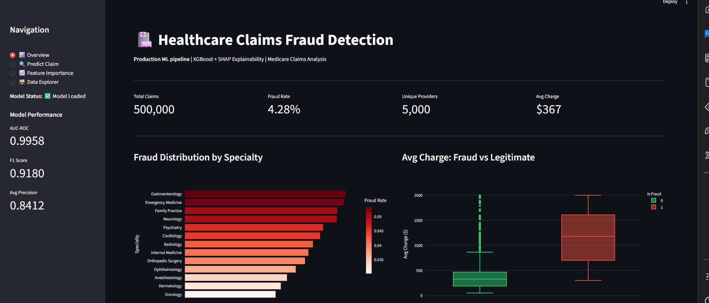
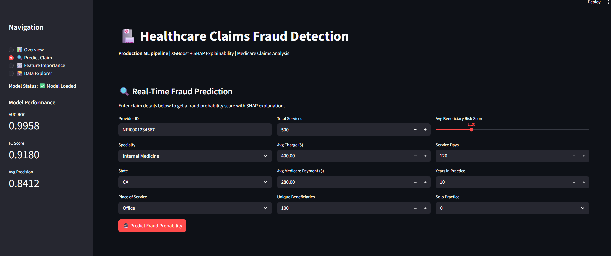
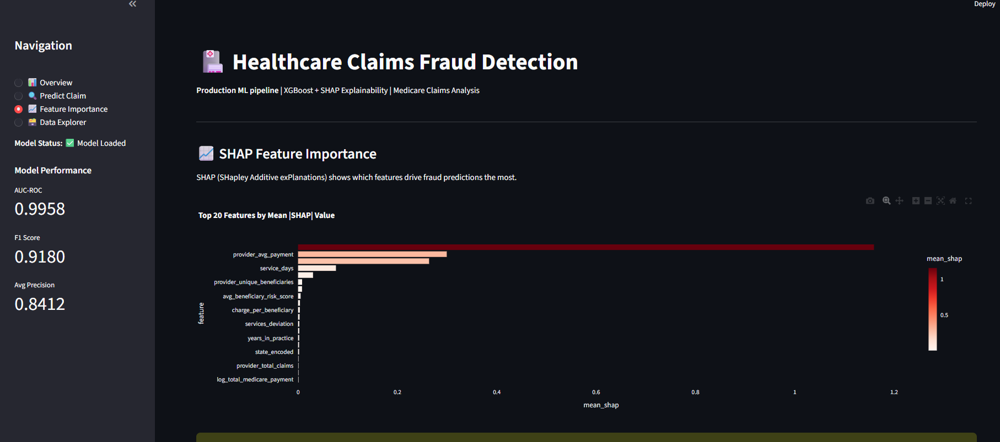

# 🏥 Healthcare Claims Fraud Detection


> **Production-grade ML pipeline** for detecting fraudulent Medicare claims — featuring XGBoost with SHAP explainability, a FastAPI REST endpoint, and an interactive Streamlit dashboard.

---

## 📊 Results

| Metric | Score |
|--------|-------|
| AUC-ROC | **0.9958** |
| F1 Score | **0.9180** |
| Avg Precision | **0.8412** |
| Dataset Size | **500,000 claims** |
| Fraud Rate | **4.28%** |
| Features Engineered | **27** |

---

## 🖥️ Dashboard Preview

### Overview — Fraud Analytics

> Real-time metrics: 500K claims analyzed, fraud distribution by medical specialty, and avg charge comparison between fraudulent and legitimate providers across all US states.

### Real-Time Fraud Prediction

> Enter any claim details and get an instant fraud probability score with a live gauge chart and SHAP-based explanation of the top risk factors driving the prediction.

### SHAP Feature Importance

> SHAP reveals that provider_avg_payment is the strongest signal for fraud — providers with unusually high Medicare reimbursements relative to peers are flagged as high risk.

---

## 🏗️ Architecture

```
┌─────────────────────────────────────────────────────────────┐
│                    FULL PIPELINE                            │
│                                                             │
│  Raw Data          ETL Pipeline        ML Model             │
│  ─────────   →    ─────────────   →   ─────────────        │
│  500K synth        Validate            XGBoost              │
│  Medicare          Clean               SMOTE balancing      │
│  claims            Engineer 27         Cross-validation     │
│                    features            SHAP explainability  │
│                    Load PostgreSQL                          │
│                         │                    │              │
│                         ▼                    ▼              │
│                    Streamlit            FastAPI             │
│                    Dashboard            REST API            │
│                    (port 8501)          (port 8000)         │
└─────────────────────────────────────────────────────────────┘
```

---

## ⚙️ Tech Stack

| Layer | Technology |
|-------|-----------|
| Data Generation | NumPy (vectorized, 500K records in ~10s) |
| ETL & Feature Engineering | Pandas, SQLAlchemy, PostgreSQL |
| Class Imbalance | SMOTE (imbalanced-learn) |
| ML Model | XGBoost (AUC: 0.9958) |
| Explainability | SHAP (TreeExplainer) |
| REST API | FastAPI + Uvicorn |
| Dashboard | Streamlit + Plotly |
| Testing | Pytest (12 tests) |
| Containerization | Docker + Docker Compose |

---

## 📁 Project Structure

```
healthcare-fraud-detection/
├── data/
│   └── ingest.py            # Vectorized Medicare dataset generator
├── pipeline/
│   └── etl.py               # Extract → Validate → Transform → Load
├── models/
│   └── train.py             # XGBoost + SMOTE + SHAP + cross-validation
├── api/
│   └── main.py              # FastAPI prediction endpoints
├── dashboard/
│   └── app.py               # 4-page Streamlit dashboard
├── tests/
│   └── test_pipeline.py     # 12 unit tests (ETL + model + API)
├── docker-compose.yml        # PostgreSQL + API + Dashboard services
├── requirements.txt
├── run_all.py               # Single command to run full pipeline
└── README.md
```

---

## 🚀 Quick Start

### 1. Clone the repo
```bash
git clone https://github.com/KirtanPatel30/healthcare-fraud-detection
cd healthcare-fraud-detection
```

### 2. Install dependencies
```bash
pip install -r requirements.txt
```

### 3. Run the full pipeline (one command)
```bash
python run_all.py
```

### 4. Launch the dashboard
```bash
streamlit run dashboard/app.py
# → http://localhost:8501
```

### 5. Start the REST API
```bash
uvicorn api.main:app --reload
# → http://localhost:8000/docs
```

### 6. (Optional) Run with Docker
```bash
docker-compose up
```

---

## 🔌 API Endpoints

| Method | Endpoint | Description |
|--------|----------|-------------|
| `GET` | `/health` | Health check + model status |
| `GET` | `/metrics` | Model performance metrics |
| `POST` | `/predict` | Single claim prediction + SHAP explanation |
| `POST` | `/predict/batch` | Batch predictions |

### Example Response
```json
{
  "provider_id": "NPI0001234567",
  "fraud_probability": 0.9423,
  "is_fraud_predicted": true,
  "risk_level": "HIGH",
  "top_risk_factors": [
    {"feature": "provider_avg_payment", "shap_value": 1.243},
    {"feature": "payment_charge_ratio", "shap_value": 0.872},
    {"feature": "services_per_beneficiary", "shap_value": 0.654},
    {"feature": "avg_beneficiary_risk_score", "shap_value": 0.521},
    {"feature": "inpatient_flag", "shap_value": 0.398}
  ]
}
```

---

## 🧠 Key Features Engineered

| Feature | Description | Why It Matters |
|---------|-------------|----------------|
| `payment_charge_ratio` | Medicare payment / charge amount | Fraud providers have unusually high ratios |
| `services_per_beneficiary` | Total services / unique patients | Fraud providers over-bill per patient |
| `avg_beneficiary_risk_score` | Average patient risk score | Fraudsters claim sicker patients |
| `provider_avg_payment` | Provider-level average payment | Outlier detection vs peers |
| `high_risk_score_flag` | Risk score > 2.0 | Binary anomaly flag |
| `inpatient_flag` | Inpatient Hospital billing | Fraudsters over-use expensive settings |

---

## 🧪 Tests

```bash
pytest tests/ -v
# 12 passed in 8.07s
```

---

## 📌 What I Learned

- Handling severe **class imbalance** (4.28% fraud rate) using SMOTE oversampling
- **SHAP explainability** for making black-box ML models interpretable in regulated industries
- Building **production REST APIs** with FastAPI including request validation and batch endpoints
- **Feature engineering** from raw claims data — behavioral patterns matter more than raw amounts
- End-to-end **MLOps practices**: data validation, cross-validation, model persistence, monitoring

---

## 📬 Contact

**Kirtan Patel** — [LinkedIn](https://www.linkedin.com/in/kirtan-patel-24227a248/) | [Portfolio](https://kirtanpatel30.github.io/Portfolio/) | [GitHub](https://github.com/KirtanPatel30)
